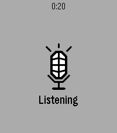
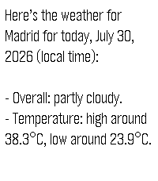

<p align="center">
  
</p>

<h1 align="center">Voice Relay</h1>

<p align="center">
  Dictate on your wrist, relay to your own endpoint.
</p>

<p align="center">
  <a href="https://apps.rePebble.com/4e5ef67664e84cb49c9025d9">Get it from the appstore</a>
  ·
  <a href="https://github.com/maxmaxme/pebble-voice-relay/actions/workflows/check.yml"></a>
</p>

<p align="center">
  
  &nbsp;&nbsp;
  
</p>

Launch the app and it starts listening. Press Select when you're done, and what
you said goes to an HTTP endpoint you configure — your own server, your own
model, your own key. The answer comes back as text on the watch.

Written in JavaScript: [Alloy](https://developer.repebble.com) (Moddable XS) on
the watch, PebbleKit JS on the phone. Targets **emery**, which is what obelix /
Core 2 Duo builds report as.

**You need an endpoint of your own.** There is no built-in service, no account,
and nothing is sent anywhere except the address you enter.

## Flow

1. Launching the app starts dictation immediately.
2. **Select** ends the recording; the phone-side JS gets the transcript.
3. The phone POSTs `{"text": "..."}` to your endpoint with your headers.
4. The endpoint answers `{"response": "..."}` and the text appears on the watch.

**Select** speaks again. **Up/Down** scroll a page at a time. **Back** exits.

The screen is a touchscreen, but scrolling by finger is not offered — see the
note at the bottom.

## Settings

In the Pebble phone app, open the app's settings:

- **Endpoint URL** — where the transcript is POSTed.
- **Headers** — one per line, `Name: value`. For example
  `Authorization: Bearer sk-...`.

The settings page is generated locally as a `data:` URI, so there is nothing to
host.

**Test** posts the word `test` to the URL in the form, using the headers in the
form, and prints the status and body below the button. It neither saves the
settings nor involves the watch — the request goes straight from the phone's
browser, so the endpoint has to allow cross-origin requests (send
`Access-Control-Allow-Origin` and handle the `OPTIONS` preflight) for this to
work. The watch's own requests are not subject to that.

## Endpoint contract

```http
POST <your url>
Content-Type: application/json
<your headers>

{"text": "what the watch heard"}
```

```http
200 OK
{"response": "what to show on the watch"}
```

Any non-2xx status, a timeout (30 s), or a body that is not JSON with a
`response` field shows an error on the watch instead — along with whatever the
server said about it.

## Build

```sh
npm run build            # tests, then compile
npm run check            # tests only
npm run install:watch    # compile and install over the CloudPebble connection
npm run install:phone    # same, straight to PEBBLE_PHONE on the local network
npm run screenshot -- docs/reply.png
```

`pebble` lives in this repo's own `.venv`; `npm run setup` recreates it on a
fresh checkout, and the SDK downloads itself on first use. Keep the connection
flag the scripts pass — a bare `pebble install` exits with "No pebble connection
specified" unless `PEBBLE_PHONE` or `PEBBLE_CLOUDPEBBLE` is exported, which will
not be the case when the command runs from an IDE.

## Testing

`npm run check` covers what can be tested off-device: word wrapping, header
parsing, the settings page wiring, and every branch of the phone-side relay
driven through fake host objects.

The rest needs real hardware with a connected phone: speech recognition runs
through the phone, and the emulator has none. Calling
`dictation_session_start()` in the emulator closes the app outright — this
happens with a plain C app too, so it is an emulator limitation rather than
something in this code.

## Icons

`tools/make-icons.py` draws all of them on one grid, so the shape is edited in a
single place:

```sh
.venv/bin/python tools/make-icons.py
```

- `resources/images/menu-icon.png` — 25×25 launcher icon. Pebble uses it as a
  mask, so the script snaps it to fully opaque or fully transparent pixels.
- `store/icon-80.png`, `store/icon-144.png` — the two sizes the appstore wants.

## Publishing

```sh
.venv/bin/pebble login
.venv/bin/pebble publish --icon-small store/icon-80.png --icon-large store/icon-144.png \
  --screenshots store/emery_1.png store/emery_2.png
```

Screenshot filenames must start with the platform name. Nothing goes live until
`--is-published` is passed, and the changelog is edited on the store dashboard
rather than through the CLI.

Take screenshots while a reply is on screen rather than mid-recording: the image
travels over the same Bluetooth link as the audio.

## What is deliberately not here

- **Sending audio instead of a transcript.** Apps cannot get raw microphone
  data; the only microphone API on the watch (`dictation`, both in C and in
  Alloy JS) hands back already-transcribed text. Raw PCM would also need
  roughly 16 KB/s over a link that carries a few KB/s.
- **Spoken replies.** The speaker API can stream PCM, but that PCM would have to
  arrive over AppMessage — a few seconds of speech takes minutes to transfer.
- **Stopping by tapping the screen.** The watch has a touchscreen and Alloy
  exposes it, but recording happens inside the system's modal dictation window,
  where stop-with-result is bound to Select. The API an app can call
  (`dictation.stop()`) kills the session without returning a transcript.
- **Scrolling by finger.** Every touch event dispatches a JS callback in the
  app's task, and a continuous drag produces enough of them to take the app
  down — reliably so when dragging slowly, which lasts longer. Throttling
  inside the callback does not help, because the callback still runs per event.
  Buttons scroll instead.
